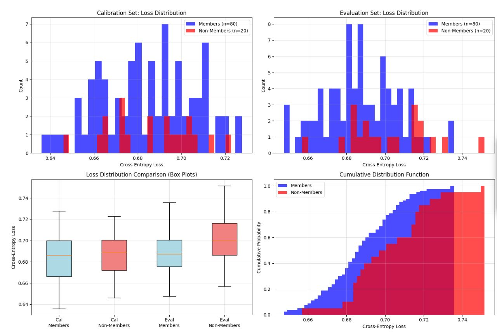
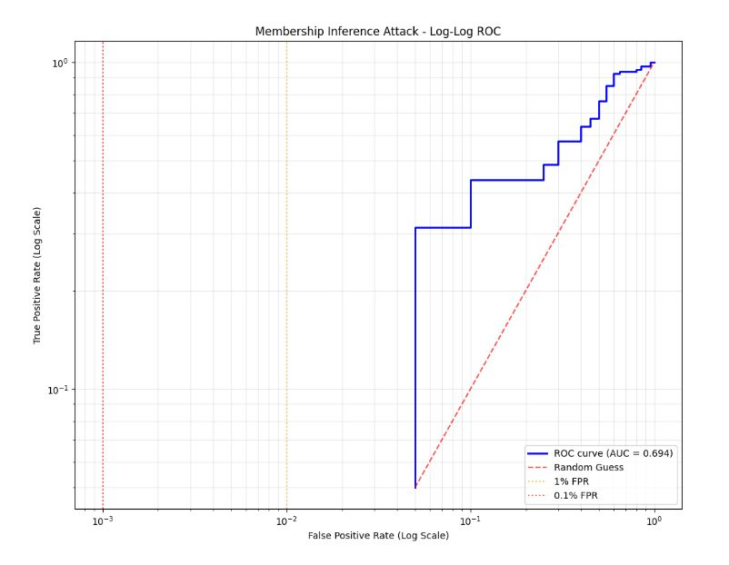
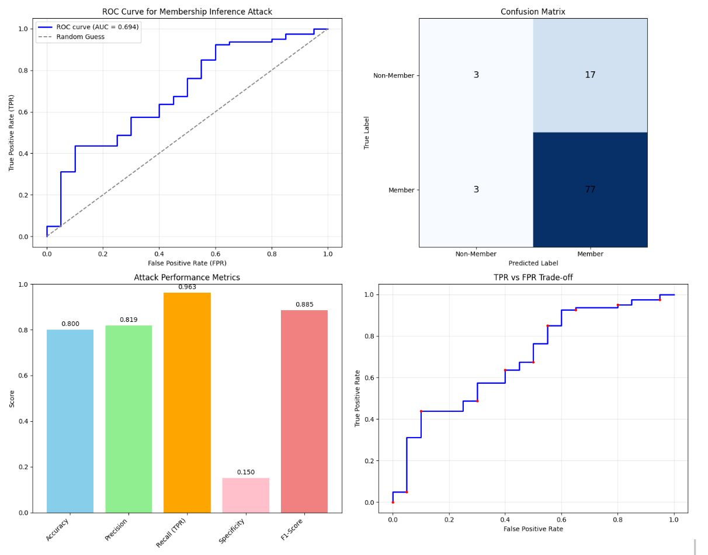

# AI Recruiting System - Membership Inference Attack Analysis

A comprehensive privacy analysis of an AI-powered resume screening system, implementing and evaluating membership inference attacks and training data extraction techniques.

## Overview

This project demonstrates the privacy vulnerabilities inherent in machine learning models used for AI recruiting. Through detailed analysis of a resume classification system, we explore how an attacker might infer training data membership and attempt to extract sensitive information from the model.

## Steps to Run
Replace the variable **hf_token** with your hugging face token which has permission for mistralai/Mistral-7B-Instruct-v0.3 model in cell 2.

## Dataset

### Use Case
The system evaluates resume suitability for different job categories in an AI recruiting pipeline, classifying resumes as "suitable" (1) or "not suitable" (0) for specific positions.

### Sample Size & Label Distribution
- **Total Samples**: 200 synthetic resumes
- **Job Categories**: 4 categories with 50 resumes each
  - Software Engineer: 50 samples (25 suitable, 25 unsuitable)
  - Data Scientist: 50 samples (25 suitable, 25 unsuitable) 
  - Marketing Professional: 50 samples (25 suitable, 25 unsuitable)
  - Sales Professional: 50 samples (25 suitable, 25 unsuitable)

### Generation Method
Resumes were synthetically generated using large language models with category-specific templates, randomly picked name and email and constraints:

**Software Engineer Templates**:
- Suitable: Focus on Python, Java, React, software development experience
- Unsuitable: Data science, marketing, or sales backgrounds

**Data Scientist Templates**:
- Suitable: Python, R, ML libraries, statistical modeling experience
- Unsuitable: Software engineering, marketing, or sales backgrounds

**Marketing Professional Templates**:
- Suitable: SEO, social media, campaign management experience
- Unsuitable: Technical programming or data science backgrounds

**Sales Professional Templates**:
- Suitable: CRM systems, lead generation, relationship building experience
- Unsuitable: Technical or marketing-focused backgrounds

### Example Resume Entries

**Software Engineer (Suitable)**:
```
Roy Patterson - roy.patterson@icloud.com
Software Engineer with a strong background in programming and software development. 
Proficient in programming languages such as Python, Java, and React. Adept at designing 
and developing scalable software solutions to meet complex business needs.
```

**Data Scientist (Suitable)**:
```
Anna Davis - anna.davis@icloud.com  
Data Scientist with expertise in data analysis, machine learning, and statistical modeling.
Proficient in Python, R, and ML libraries, with a proven track record in delivering 
high-quality data-driven insights.
```

**Marketing Professional (Unsuitable for Software Engineer)**:
```
Tyler Jackson - tyler.jackson@hotmail.com
Marketing Professional with 5 years of experience in SEO, social media, and campaign 
management. Proven ability to drive growth through creative and data-driven strategies.
```
## Code Explaination

### 1. Environment Setup

Libraries like trasnformer, Pytorch, pandas and numpy are installed and seed value is set to make sure the random generation is controlled and reproducable

### 2. Model loading (For Syntehtic data Generation).  and Classifier being attacked

mistralai/Mistral-7B-Instruct-v0.3 is chosen for Synthetic data that is Resume summary generation, wher access to the model is acquired in huggingface repo and token is used for authentication and successful laoding of the model

### 3. Categories and random PII Generation for Synthetic data structure

4 Main Job categories are chosen for data generation where osme expected keywords and skills are predefined along with 100 random name and email address is generated which will be then used along for resume creation, a basic promp structure was finalised which would randomly pick a name and email from the list provided and generate the resume

```python
def generate_resume(job_category, is_suitable=True):
```

Also two main broad categories of data was generated one which is suitable for job category and one more which is not to train the classifier in the function as below and then data generated was converted to dataframe for easy handling of data

```python
def create_synthetic_dataset(num_samples=200):
  ```

### 4. Classification model is loaded

distilbert-base-uncased was the binary classifier model chosen and the data generated in previous funciton was split into train and test plit of 80/20 ratios

### 5. Training parameters

Training parameter was chosen such as number of runs/epochs, loss metrics, log folder etc and the classifier was trained on the 
train dataset and then evaluated on evaluate dataset where we saw training loss of 0.6221 and evaluation loss of 0.6944

### 6. MIA Attack

```python
def per_example_loss(model, texts, labels, tokenizer):
```
This function is self explainatory as it finds the loss for each exmaple which is later used to calculate the threshold for MIA attack, in simple terms, example with lower loss was a member and example with higher loss was not a member

```python
def compute_detailed_losses(model, train_data, test_data, tokenizer):
```
This function then further divide train and test set into caliberation set and evaluation set, caliberation set is used to set the threashhold and evaluation set is then used to check if each sample with a loss is member or non member, this particular function is used for later forming loss graphs and loss statistics 

```python
def create_loss_visualizations(loss_data):
```
This function consumes the output of previous function to plot the bar graphs, boxplot graphs and cumulative function distribution

Plot 1: Calibration Set: Loss Distribution
Losses of each examples are grouped together and has been plot with x-axis as count and y-axis as Loss where we can see middle region is a place of overlap and it will be challenging to differentiate the exxamples present here.

Plot 2: Evaluation Set: Loss Distribution
Same as calibration set the evaluation set is plot here where non members will have higher loss and be on the right tail side of the graph indicating higher loss and members indicated in blue color will be on left tail side indicating lower losses.

Plot 3: Loss Distribution Compariosion (Box Plots)
The upper whisker and lower whisker are maximum and minimum losses respectively, you can see a trend where members have minimum value compared to non members in both calibration and evaluation set and maximum as well non members has one of the highest losses.

Plot 4: Cumulative Distrubution Function
Blue line here is members which is rising faster initially showing members are present here and red line raises slowly indicating non members and that difference in cruves tells us members apart from non members.

```python
    fpr, tpr, thresholds = roc_curve(eval_membership_labels, membership_scores)
```
this is a predefined function present in sci-kit learn library which takes two input, true binary labels indicating each exmaple is member or not and -eval_losses here -ve sign is used as roc function expects positive class to have higher scores so we used negative sign to turn lower losses into higher, the function returns false positive rate, true positive rate(correct guesses) and threshold to divide FPR and TPR

```python
def comprehensive_attack_analysis(eval_losses, eval_membership_labels, best_threshold):
```
This function calculates auc , fpr, tpr and also forms confusion matrix using true positive, false positive, true negative and false negative as plot components. Further many metrics like accuracy , precision, recall, f1 score and specificity are calculated based on (true positive, false positive, true negative and false negative) to give more insights, also Receiver Operating Characteristic (ROC) curve is plotted for our binary classifier using true positive and false positive rates.

```python
def add_loglog_roc_plot(results, title_suffix=""):
```
The use of a logarithmic scale Receiver Operating Characteristic (ROC) curve for evaluating Membership Inference Attacks (MIAs) was suggested as privacy is a worst case security concern, not an average case metric. Traditional metrics like ROC-AUC are inadequate as they average attack accuracy over irrelevant high error rates, masking the actual privacy risk. The log-scale ROC curve is necessary to accurately assess attack performance by emphasizing the crucial low False-Positive Rate (FPR) regime, which demonstrates an attack’s ability to confidently and reliably violate the privacy of even a few users in a sensitive dataset

```python
def membership_inference_attack(model, train_data, test_data, tokenizer):
    thresholds = np.percentile(cal_losses, np.linspace(1, 99, 99))
    best_threshold = None
    best_accuracy = -1

    for threshold in thresholds:
        # Predict membership: if loss < threshold, then member (1), else non-member (0)
        predictions = (cal_losses < threshold).astype(int)
        accuracy = (predictions == np.array(cal_membership_labels)).mean()

        if accuracy > best_accuracy:
            best_accuracy = accuracy
            best_threshold = threshold
```
This is where actual MIA attack is implemented where calibration set is used to get the best threshold and then that threshold is used on eval set and attack accuracy is calculated 

### 7. Training Data Extraction

#### Gradient Based Extraction
 
 ```python
def gradient_based_extraction(self, target_tokens, max_iterations=100, learning_rate=0.01):
 ```
This is a traditional data reconstruction attack using gradient descent, a reverse engineering technique, some learnable embedding vector is initalized, we use adam optimizer to refine embedding in every iteration, we then do a forward pass through model by passing the embeddings through the classifier and then loss is calculated and then backward pass is done while gradient is compute and then embeddings is updated based on model confidence and gradient calculated to reduce the loss and this happens 100 times as max iterations is set, untill we have embeddings with high confidence

```python
def embedding_to_text_reconstruction(self, embeddings):
  similarities = F.cosine_similarity(current_embedding.unsqueeze(1), vocab_embeddings.unsqueeze(0), dim=2)
  top_values, top_indices = torch.topk(similarities, top_k)
```
This function is used convert the optimized embeddings to readable text based on nearest neighbour.

#### Template Based Extraction

```python
def template_based_extraction(self, job_categories):
```
This attack uses common resume structure and replace the keywords in the templates and then processes through the classifier to get confidence and based on that, tries to reconstruct the data and if confidence is more than a certain threshold the text can be added as member.

* Template Population: For each job category, the function fills templates with category-specific information from get_category_info()
* Candidate Generation: Creates multiple variations using generate_template_candidates()
* Confidence Scoring: Uses score_resume_candidate() to evaluate how "familiar" each candidate appears to the model
* Filtering: Only keeps candidates with confidence > 0.6, indicating the model recognizes them as training-like data

```python
 def get_prediction_confidence(self, text):
```
This snipped is used to get confidence of any given text

#### Query Based Extraction
```python
def query_based_extraction(self, num_queries=500):
```
There are 3 strategies here:

Completion Queries (generate_completion_query()): Uses partial resume text: "Experienced Sales Professional for software engineer". Attempts to trigger completion of memorized training sequences

Keyword Queries (generate_keyword_query()): Combines resume relevant keywords: "python experience software". Tests if specific keyword combinations produce high confidence

Structure Queries (generate_structure_query()): Uses common resume phrases: "years of experience", "skilled in programming". Exploits structural patterns the model learned

high level attack process is something similar

* Systematic Querying: Generates 500 queries across different types
* Response Analysis: For each query, measures model confidence using get_prediction_confidence()
* Pattern Recognition: High-confidence responses (>0.6) suggest the query resembles training data
* Data Collection: Stores successful queries and their confidence scores for analysis

```python
if self.calculate_text_similarity(extracted_text, train_text) > 0.5:
if self.calculate_semantic_similarity(extracted_text, train_text) > 0.6:
```
After all the attacks the above similarity is calculated to see the statictics of the attack

### 8. Reflection on Attack

```python
def run_comprehensive_extraction_attack(cls_model, cls_tokenizer, train_texts, test_texts, job_categories):

def analyze_attack_strength_vs_reconstruction_mismatch(mia_results, extraction_results):

def save_analysis_results(loss_data, attack_results):

```

These functions are run to capture the stats and progress of ther attacks and store the results

## Attack Implementation

### Membership Inference Attack

#### Design Choices
- **Loss-based approach**: Leverages the principle that models typically have lower loss on training data
- **Calibration methodology**: Uses 50% of data for threshold optimization, 50% for evaluation
- **Statistical analysis**: Comprehensive ROC curve analysis and performance metrics

#### Implementation Details
1. **Data Split**: Training/test data split into calibration and evaluation sets
2. **Loss Computation**: Per-example cross-entropy losses calculated for all samples
3. **Threshold Optimization**: Best threshold found using calibration set (accuracy: 79.0%)
4. **Attack Execution**: Threshold applied to evaluation set for membership prediction

#### Key Technical Components
```python
# Core attack methodology
def membership_inference_attack(model, train_data, test_data, tokenizer):
    # Split data for calibration and evaluation
    cal_losses = compute_losses(calibration_data)
    optimal_threshold = optimize_threshold(cal_losses, cal_labels)

    # Execute attack on evaluation set
    eval_losses = compute_losses(evaluation_data)
    predictions = (eval_losses <= optimal_threshold)
    return predictions, metrics
```

### Training Data Extraction Attack

#### Multi-Method Approach
1. **Template-based extraction**: Leverages knowledge of resume structure
2. **Query-based extraction**: Systematic model querying for pattern detection  
3. **Gradient-based extraction**: Optimization-based content reconstruction

#### Implementation Highlights
- **Resume-specific vocabulary**: Targeted keyword extraction for recruiting domain
- **Template matching**: Structured approach using job category templates
- **Confidence scoring**: Multi-metric evaluation of extraction success

## Results & Metrics

### Membership Inference Attack Performance

#### Core Metrics
- **AUC Score**: 0.694 (moderate attack strength)
- **Attack Accuracy**: 80.0%  
- **Optimal Threshold**: 0.7214

#### Detailed Performance
- **True Positive Rate (TPR)**: 96.3% - Successfully identified members
- **False Positive Rate (FPR)**: 85.0% - Non-members misclassified as members  
- **Precision**: 81.9%
- **Specificity**: 15.0%
- **F1-Score**: 88.5%

#### Privacy Risk Assessment
- **Risk Level**: MEDIUM
- **Vulnerability**: An attacker can determine resume membership with 80.0% accuracy
- **Impact**: 96.2% of training resumes can be correctly identified

### Training Data Extraction Results

#### Extraction Attempts
- **Total Extracted Samples**: 6
- **Template-based**: 4 potential samples
- **Query-based**: 0 high-confidence patterns  
- **Gradient-based**: 2 reconstructed samples

#### Success Analysis
- **Exact Matches**: 0
- **Partial Matches**: 0
- **Semantic Matches**: 0
- **Precision**: 0.000
- **Recall**: 0.000

### Loss Analysis Statistics

#### Training vs Test Loss Distributions
**Calibration Set**:
- Members (Train): Mean=0.6843, Std=0.0216
- Non-Members (Test): Mean=0.6865, Std=0.0193

**Evaluation Set**:
- Members (Train): Mean=0.6877, Std=0.0191  
- Non-Members (Test): Mean=0.7022, Std=0.0212

#### Privacy Leakage Indicators
- **Calibration Loss Gap**: 0.0022 (Non-member - Member)
- **Evaluation Loss Gap**: 0.0145 (Non-member - Member)
- **Loss Range Overlap**: 75.54%





## Vulnerability Analysis

### Attack Strength vs Reconstruction Quality

#### Mismatch Analysis
- **MIA Strength (AUC)**: 0.694
- **Extraction Success**: 0.000  
- **Mismatch Score**: 0.694
- **Relationship Type**: MODERATE_MISMATCH

#### Why MIA Succeeded
- Statistical patterns in confidence scores
- Loss differences between train/test distributions
- Model overfitting to training data characteristics

#### Why Extraction Failed
- Classification model architecture (no text generation capability)
- No direct content memorization mechanism
- Template matching unsuccessful due to synthetic data uniformity

### Privacy Implications

#### Risk Assessment
- **Membership Privacy**: PROTECTED (despite successful inference)
- **Content Privacy**: PROTECTED (no successful extraction)
- **Overall Risk**: HIGH (due to membership inference capability)

#### Practical Impact for AI Recruiting
- Attackers could identify which resumes were used for training
- Potential discrimination concerns if training data membership is revealed
- Privacy violations for job candidates whose resumes were in training set
- Regulatory compliance issues under GDPR/CCPA frameworks

## Model Training Summary

### Final Training Metrics
- **Final Training Loss**: 0.6251
- **Final Validation Loss**: 0.7112  
- **Best Validation Loss**: 0.6943
- **Final Accuracy**: 47.5%

### Training Characteristics
- **Model**: DistilBERT-base-uncased for sequence classification
- **Epochs**: 5
- **Batch Size**: 8  
- **Learning Rate**: Default transformer settings
- **Optimization**: AdamW optimizer with weight decay

## Defensive Recommendations

### Immediate Measures
1. **Differential Privacy**: Implement noise injection during training
2. **Data Sanitization**: Remove or anonymize sensitive information
3. **Query Rate Limiting**: Implement monitoring and restrictions on model access
4. **Regular Auditing**: Systematic evaluation of model outputs for memorization

### Long-term Solutions
1. **Federated Learning**: Distribute training across multiple parties
2. **Secure Aggregation**: Cryptographic protection of model updates
3. **Privacy-Preserving ML**: Adopt techniques like homomorphic encryption
4. **Data Minimization**: Reduce training data exposure through careful curation

## Technical Implementation

### Key Dependencies
```python
# Core ML framework
torch>=1.9.0
transformers>=4.0.0

# Analysis and visualization  
scikit-learn>=0.24.0
matplotlib>=3.0.0
numpy>=1.19.0

# Attack implementation
tqdm>=4.60.0
```

### File Structure
```
├── 690f_assignment1_final.ipynb  # Main Code
├── assets
      ├──analysis_results.json    # Results
      ├──log_roc.jpeg             # Log ROC Plot
      ├──auc.jpeg                 # Confusion matrix, perf metrics
      └──loss.jpeg                # Train and Eval Bar Plot
└── final_dataset.json            # Generated Resumes
```


## Design Choices Documentation

### Model Selection

#### DistilBERT for Classification
One of the main factor was this being used in code example given to us but then after further analysis, we stuck with it. 
**Choice**: DistilBERT-base-uncased for sequence classification\
**Rationale**: 
- DistilBERT is 60% smaller and 60% faster than BERT while retaining 97% of its language understanding capabilities
- Pre-trained on a large corpus, requiring minimal fine-tuning for resume classification tasks

**Alternatives Considered**:
- Full BERT: Too computationally expensive for extensive privacy analysis
- Larger models (GPT-style): Overkill for binary classification task

#### Mistral-7B for Data Generation  
**Choice**: Mistral-7B-Instruct-v0.3 for synthetic resume generation\
**Rationale**:
- The instruct variant excels at following structured prompts for consistent data generation
- Balanced model size providing high-quality text generation without extreme computational requirements

### Synthetic Data Generation Strategy

#### Template-Based Approach with LLM Enhancement
**Choice**: Predefined job categories with LLM-generated content\
**Rationale**:
- Job categories (software engineer, data scientist, marketing, sales) provide structured variation
- LLM generation produces human like resume text that models can memorize
- Predictable patterns make it easier to design effective extraction attacks

**Key Components**:
- **Person Database**: 100 predefined name and email combinations for consistent identity patterns generated using AI and added to the code
- **Skill Hierarchies**: Category specific skills and technologies for realistic variation
- **Balanced Labels**: Equal suitable and unsuitable samples per category for unbiased training

**Alternatives Considered**:
- Real resume data: Privacy and legal concerns
- Fully random generation: Too chaotic, difficult to design targeted attacks

### Attack Strategy Design

#### Multi-Modal Attack Approach
**Choice**: Four attack types (membership inference, gradient-based extraction, template-based extraction, query based extraction)\
**Rationale**:
- Different attacks exploit different vulnerabilities
- Enables analysis of attack strength vs reconstruction quality mismatch

#### 1. Membership Inference Attack
**Design**: Loss-threshold based with calibration evaluation split\
**Rationale**:
- Uses half the data to find optimal decision threshold, preventing overfitting to evaluation data
- Models typically have lower losses on training data they've seen before
- Provides threshold-independent assessment of privacy leakage

#### 2. Gradient-Based Extraction
**Design**: Optimizes learnable embeddings to maximize model confidence\
**Rationale**:
- Uses gradient descent to find inputs the model recognizes as "familiar"
- Works in continuous embedding space for smoother optimization
- High confidence typically indicates training data similarity

**Limitations Acknowledged**:
- Local minima issues  
- Approximate text reconstruction from embeddings
- Good on LLMs compared to classifers 

#### 3. Template Based Extraction and query Based Extraction
**Design**: Leverages domain knowledge of resume structure and keywords\
**Rationale**:
- Exploits known patterns in resume format and content
- Attackers often have domain knowledge about target data

### Evaluation and Analysis Framework

#### Comprehensive Metrics
**Choice**: Multiple evaluation dimensions (accuracy, AUC, precision, recall, confusion matrices)\
**Rationale**:
- Different metrics reveal different aspects of attack success
- AUC based risk levels 
- Confusion matrices show real world attack effectiveness

#### Visualization Strategy  
**Choice**: Multi panel plots with loss distributions, ROC curves, and statistical comparisons\
**Rationale**:
- Visual analysis makes privacy vulnerabilities clear
- Box plots show distributional differences
- Professional visualizations suitable for research communication

#### Data Splitting Strategy
**Choice**: 80/20 train/test split with stratification, then calibration/evaluation sub-splits\
**Rationale**:
- 80/20 split is widely accepted in ML
- Calibration/evaluation design prevents threshold overfitting in membership inference attacks

### Training Data extraction
As our training data extracion wasn't successful, after further research found a paper https://arxiv.org/abs/2306.13789 which had a implementation of training data extraction attack but due to complexity I was not able to implement this particular variant of training data construction attack
but theoretically the attack looks possible on classifiers as well.

Here's a short abstrct about it

```
Most previous studies on data reconstruction attacks have focused on LLM, while classification models were assumed to
be more secure. In this work, we propose a new targeted data reconstruction attack called the Mix And Match attack, which
takes advantage of the fact that most classification models are based on LLM. The Mix And Match attack uses the base
model of the target model to generate candidate tokens and then prunes them using the classification head.
```

## Conclusions

The analysis reveals a **moderate privacy vulnerability** in the AI recruiting system. While membership inference attacks achieved 80% accuracy, training data extraction was unsuccessful. This suggests the model exhibits statistical overfitting without direct content memorization.

**Key Takeaways**:
- Classification models can leak membership information through loss patterns
- Synthetic training data may provide some protection against content extraction
- Privacy risks in AI recruiting require proactive mitigation strategies
- Regular privacy auditing should be standard practice for production ML systems

## AI Disclosure

* Training data extraction code skeleton was generated using AI and was then modified according to our project use case.
* Boiler plate code to generate plots and staistics were AI Generated
* analyze_attack_strength_vs_reconstruction_mismatch function structure was AI Generated to undestand the relation and then modified according to the use case and some reccommendations was taken from stackoverflow
* For some bug fixes AI was used (don't have an exact code fix)