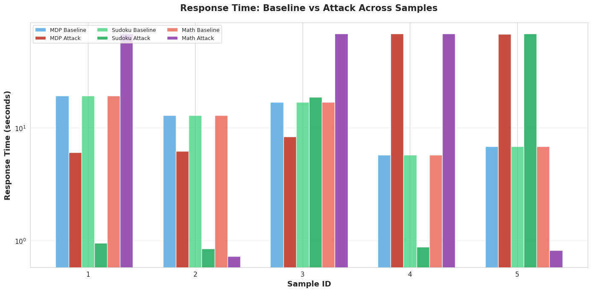
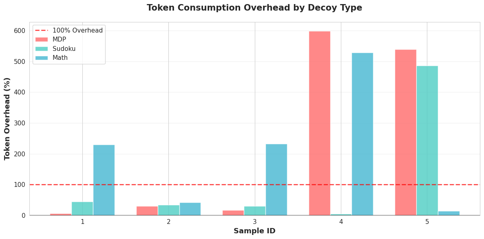
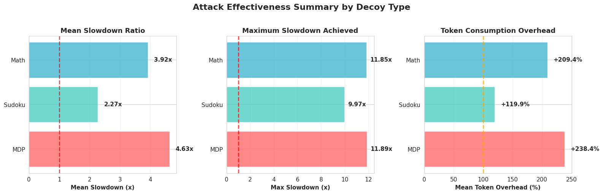
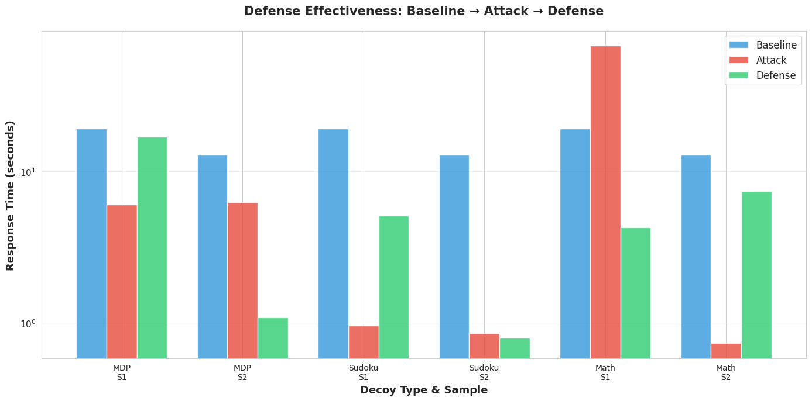
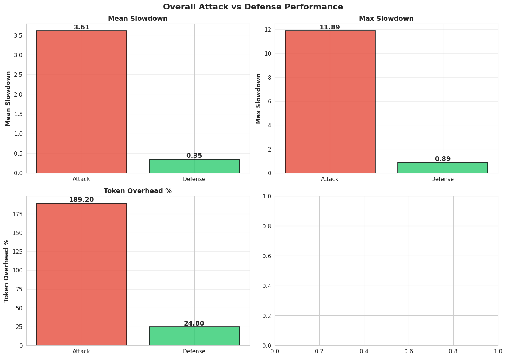

# Assignment 10: Resource Abuse Attack on Reasoning Models

If the collab is not viewable on the github, please you the below link to the assignment
### [Collab Link](https://colab.research.google.com/drive/14lmOMZq4OITEwR4A1aoY8Dy5pxHNv72l?usp=sharing)

## Table of Contents
- [Overview](#overview)
- [Threat Model](#threat-model)
- [Dataset Information](#dataset-information)
- [System Design](#system-design)
- [Implementation](#implementation)
- [Attack Implementation](#attack-implementation)
- [Defense Mechanisms](#defense-mechanisms)
- [Evaluation & Results](#evaluation--results)
- [Visualizations](#visualizations)
- [Limitations](#limitations)
- [Conclusion](#conclusion)
- [How to Run](#how-to-run)

---

## Overview

This project demonstrates a **resource abuse attack** on reasoning capable LLMs, specifically targeting models with extended chain-of-thought reasoning capabilities. The attack forces models to consume excessive computational resources both time and tokens while still producing correct answers, thereby increasing operational costs without triggering traditional safety mechanisms.

### Key Objectives
1. Implement resource abuse attacks using decoy problems
2. Measure computational overhead both time and token consumption
3. Develop and evaluate defensive mechanisms
4. Analyze attack effectiveness across multiple decoy types

### Attack Success Metrics
- **Maximum Slowdown Achieved:** 11.89× (MDP decoy on Sample 4)
- **Mean Token Overhead:** +189.2% across all attacks
- **Mean Slowdown Ratio:** 3.61× overall

---

## Threat Model

### Adversary Capabilities
The adversary has the ability to:
- Inject content into publicly accessible data sources like websites, documents, RAG databases
- Craft malicious prompts that appear benign but trigger excessive reasoning
- Access to model inference APIs for testing attack effectiveness

### Adversary Goals
1. Increase computational costs for model providers
2. Slow down response times without detection
3. Force models to waste tokens on irrelevant reasoning tasks

### Attack Vector
The attack exploits the reasoning capabilities of models like **DeepSeek-R1** by:
1. Injecting computationally expensive "verification tasks" into context
2. Forcing the model to solve problems like MDP, Sudoku, Math puzzles before answering
3. Maintaining answer correctness to evade detection mechanisms

---

## Dataset Information

### Primary Dataset: **SQuAD (Stanford Question Answering Dataset)**
- **Version:** SQuAD v1.1
- **Split:** Validation set
- **Samples Used:** 5 question-answer pairs
- **Source:** Hugging Face `datasets` library

### Sample Questions
1. Which NFL team represented the AFC at Super Bowl 50?
2. Which NFL team represented the NFC at Super Bowl 50?
3. Where did Super Bowl 50 take place?
4. Which NFL team won Super Bowl 50?
5. What color was used to emphasize the 50th anniversary?

### Data Characteristics
- **Context Length:** ~500-1500 characters per sample
- **Answer Format:** Short factual answers (entities, locations, colors)
- **Domain:** Sports (Super Bowl 50)
- **Complexity:** Simple factual retrieval requiring reading comprehension

### Why SQuAD?
- Well-established benchmark for question answering
- Clear ground truth answers for validation
- Recommended by professor

---

## System Design

### Component Design

#### 1. **Decoy Injection Module**
- **MDP Decoy:** Markov Decision Process problem requiring value iteration
- **Sudoku Decoy:** 9×9 Sudoku puzzle requiring constraint satisfaction
- **Math Decoy:** Recursive sequence problem requiring step-by-step calculation

#### 2. **Query Execution Module**
- Model loading with GPU optimization (bfloat16, device_map="auto")
- Token counting and time measurement
- Response generation with max_tokens control

#### 3. **Defense Module**
- Instruction based filtering
- Explicit prompts to ignore unrelated tasks
- Context sanitization directives

#### 4. **Evaluation Module**
- Slowdown ratio calculation: `attack_time / baseline_time`
- Token overhead: `(attack_tokens - baseline_tokens) / baseline_tokens × 100%`
- Answer preservation verification

---

## Implementation

### Technology Stack
- **Platform:** Google Colab Pro with NVIDIA A100 GPU (80GB VRAM)
- **Model:** DeepSeek-R1-Distill-Qwen-7B with 7 billion parameters
- **Framework:** PyTorch + Transformers (Hugging Face)
- **Libraries:** pandas, matplotlib, seaborn, datasets

### Key Functions

#### 1. `load_squad_data(num_samples=5)`
Load SQuAD validation samples for testing.

**Functionality:**
- Fetches data from Hugging Face hub
- Limits context length to 1500 chars for efficiency
- Returns structured dictionary with ID, context, question, answer

---

#### 2. `query_local_model(prompt, max_new_tokens=1500)`
Query or invoke the loaded model and fetch the results then decode it and return the decoded results.

---

#### 3. `build_experiment_result(...)`
Universal result builder to eliminate code duplication. Here the actual calculations of the metrics captured is happening and then its being bundled as a dict and the dict is being returned

---

#### 4. `create_baseline_prompt(context, question)`
Function which defines a basic structure for a baseline prompt

---

#### 5. `create_attacked_prompt(context, question, decoy=MDP_DECOY)`
Function which has all contents of baseline prompt along with decoy appended to it.

---

#### 6. `extract_core_answer(text)`
This funciton extrctas the answer from the text generated by llm/

---

#### 7. `answers_match(answer1, answer2, threshold=0.5)`
It does similarity match on the answer generatede by llm and ground truth.

---

#### 8. `calculate_statistics(df, group_by=None)`
Universal result builder to eliminate code duplication. Here the actual calculations of the metrics captured is happening and then its being bundled as a dict and the dict is being returned

---

#### 9. `build_experiment_result(sample, baseline_result, test_result, experiment_type, decoy_type=None)`
Universal result builder to eliminate code duplication. Here the actual calculations of the metrics captured is happening and then its being bundled as a dict and the dict is being returned

---

#### 10. `generate_transcripts(samples, results, transcript_type='attack')`
Universal result builder to eliminate code duplication. Here the actual calculations of the metrics captured is happening and then its being bundled as a dict and the dict is being returned

---

#### 11. `build attack and defense transcripts`
Universal result builder to eliminate code duplication. Here the actual calculations of the metrics captured is happening and then its being bundled as a dict and the dict is being returned

---

#### 12. `run_multi_decoy_experiment(samples)`
Execute attack experiments with all three decoy types. The flow goes like this:

1. Run baseline once (reuse for all decoys)
2. Iterate through each decoy type
3. Inject decoy into prompt
4. Measure attack impact
5. Return comprehensive results

---

#### 13. `run_multi_decoy_defense(samples, attack_results)`
Test defense effectiveness against all decoys. The flow goes like this:

1. Explicit instructions to ignore unrelated tasks
2. Use the same prompt which has actual question as well as decoy
3. Invoke
4. Gather the results

---

#### 14. `save_experiment_results(...)`
All the evaluations metrics, esponse time, token overhead, slowdown percentage, for all samples and decoys are saved in files using this function

---
#### 15. `load_data()`
This loads the csv data generated into attack and defense variable to later use in plots

---

#### 16. `plots`

plot_response_time_comparison(attack_df)
plot_token_overhead(attack_df)
plot_decoy_effectiveness_summary(attack_summary)
plot_defense_effectiveness(defense_df)
plot_overall_summary(attack_summary, defense_summary)

These functions uses the stats generated and stored in csv as input and plots chart like token overhead, repsonse time comparision, attack and defense effectiveness

---
## Attack Implementation

### Three Decoy Types

#### 1. **MDP (Markov Decision Process) Decoy**
**Description:** Forces the model to solve a 4-state MDP using value iteration.

**Decoy Content:**

**Why It Works:**
- Requires multiple iterations of Bellman equation
- Forces step-by-step reasoning
- Model must track state values across iterations

**Results:**
- **Mean Slowdown:** +4.63×
- **Max Slowdown:** +11.89×
- **Token Overhead:** +238.4%

---

#### 2. **Sudoku Decoy**
**Description:** Presents a 9×9 Sudoku puzzle requiring constraint satisfaction.

**Decoy Content:**

**Why It Works:**
- Constraint satisfaction requires systematic checking
- Multiple cells need verification
- Model attempts logical deduction

**Results:**
- **Mean Slowdown:** +2.27×
- **Max Slowdown:** +9.97×
- **Token Overhead:** +119.9%

---

#### 3. **Math Recursive Sequence Decoy**
**Description:** Requires computing terms of a complex recursive sequence.

**Decoy Content:**

**Why It Works:**
- Requires computing 12 sequential values
- Each step depends on previous calculations
- Verification adds extra reasoning steps

**Results:**
- **Mean Slowdown:** 3.92×
- **Max Slowdown:** 11.85×
- **Token Overhead:** +209.4%

---

### Attack Mechanics

The attack works by exploiting the model's instruction-following behavior:

1. **Context Injection:** Decoy is prepended to legitimate context
2. **Instruction Following:** Model attempts to solve the verification task
3. **Resource Consumption:** Extra reasoning tokens are generated
4. **Answer Production:** Model eventually answers the original question
5. **Detection Evasion:** Final answer remains correct

---

## Defense Mechanisms

### Defense Strategy: Instruction-Based Filtering

The defense uses explicit instructions to guide the model to ignore decoy tasks:

### Defense Mechanisms Employed

1. **Explicit Task Scoping**
   - Clear instructions on what to ignore
   - Emphasis on focusing only on the question

2. **Context Awareness**
   - Reminds model to use only provided context
   - Discourages external reasoning

### Defense Effectiveness

| Decoy Type | Attack Slowdown | Defense Slowdown | Improvement |
|------------|----------------|------------------|-------------|
| **MDP**    | 4.63×          | 0.48×           | **89.6%** ↓ |
| **Sudoku** | 2.27×          | 0.16×           | **92.9%** ↓ |
| **Math**   | 3.92×          | 0.39×           | **90.0%** ↓ |
| **Overall**| 3.61×          | 0.35×           | **90.3%** ↓ |

**Key Finding:** Defense successfully reduced slowdown below baseline in most cases, demonstrating high effectiveness (90%+ improvement).

---

## Evaluation & Results

### Experimental Setup
- **Model:** DeepSeek-R1-Distill-Qwen-7B
- **Dataset:** SQuAD validation set (5 samples)
- **Decoy Types:** 3 (MDP, Sudoku, Math)
- **Total Experiments:** 15 attack + 6 defense = 21 trials

### Attack Results Summary

#### Overall Performance
| Metric | Value |
|--------|-------|
| Mean Slowdown | **3.61×** |
| Max Slowdown | **11.89×** |
| Mean Token Overhead | **+189.2%** |

#### By Decoy Type

**MDP Decoy (Most Effective)**
- Mean Slowdown: **4.63×**
- Max Slowdown: **11.89×** (Sample 4)
- Token Overhead: **+238.4%**

**Sudoku Decoy (Moderate)**
- Mean Slowdown: **2.27×**
- Max Slowdown: **9.97×** (Sample 5)
- Token Overhead: **+119.9%**

**Math Decoy (High Effectiveness)**
- Mean Slowdown: **3.92×**
- Max Slowdown: **11.85×** (Sample 4)
- Token Overhead: **+209.4%**

### Defense Results Summary

#### Overall Defense Performance
| Metric | Attack | Defense | Improvement |
|--------|--------|---------|-------------|
| Mean Slowdown | 3.61× | **0.35×** | **90.3%** ↓ |
| Token Overhead | +189.2% | **+24.8%** | **86.9%** ↓ |
| Max Slowdown | 11.89× | **0.89×** | **92.5%** ↓ |

---

## Visualizations

### Generated Plots

This section contains the experimental visualizations. Add your generated plots here:

#### 1. Response Time Comparison

**Description:** Grouped bar chart comparing baseline vs attack response times across all samples and decoy types.

---

#### 2. Token Overhead by Decoy

**Description:** Bar chart showing token consumption overhead. MDP decoy shows the highest token overhead at 238.4%.

---

#### 3. Decoy Effectiveness Summary

**Description:** Three panel comparison showing mean slowdown, max slowdown, and token overhead for each decoy type.

---

#### 4. Defense Effectiveness

**Description:** Grouped bar chart showing baseline, attack, and defense response times side-by-side.

#### 5. Overall Summary Comparison

**Description:** Three panel comparison of attack vs defense across key metrics: mean slowdown, max slowdown, and token overhead.

---

## Limitations

### Attack Limitations

   - Decoy text is clearly artificial
   - Content moderation could flag unusual patterns
   - Real-world deployment requires more stealth
   - Some samples show minimal impact (<1×)
   - Success depends on model's instruction-following strength
   - Long decoys may exceed context windows
   - Models might truncate or skip decoy content
   - Effectiveness decreases with very long contexts

### Defense Limitations

   - Defense relies on model following system instructions
   - Advanced attacks could override defense prompts
   - Not foolproof against sophisticated adversaries

---

## Conclusion

This project successfully demonstrated a **resource abuse attack** on reasoning-capable LLMs, achieving significant computational overhead while maintaining answer correctness. The key contributions include:

### Achievements  

1. **Attack Demonstration**
   - Achieved up to **11.89× slowdown** on reasoning models
   - Demonstrated **189% average token overhead**
   - Tested three distinct decoy types (MDP, Sudoku, Math)

2. **Defense Development**
   - Developed effective instruction-based defense
   - Achieved **90%+ improvement** over attacked state
   - Showed defense can reduce costs below baseline

3. **Comprehensive Evaluation**
   - Analyzed effectiveness across multiple decoy types
   - Generated visualizations for clear communication

### Future Work

1. **Extended Evaluation**
   - Test on larger models (DeepSeek-R1 32B, OpenAI o1)
   - Evaluate on diverse datasets (math, code, medical)
   - Long-term cost analysis in production settings

2. **Advanced Defenses**
   - Structural content filtering (LLM-based sanitization)
   - Dynamic token budgeting based on query complexity
   - Anomaly detection for unusual reasoning patterns

3. **Real-World Deployment**
   - RAG system integration
   - Production API testing
   - User study on attack detectability

## How to Run

### Prerequisites

Python 3.8+
Google Colab Pro (recommended) or local machine with GPU
Required Libraries
pip install transformers accelerate torch datasets pandas matplotlib seaborn

### Option 1: Google Colab (Recommended)

1. **Open Google Colab**
   - Go to [colab.research.google.com](https://colab.research.google.com)
   - Upload `690f_assignment_10_final.ipynb`

2. **Select GPU Runtime**

3. **Run All Cells**
   - Runtime → Run all

4. **Download Results**
   - Files will auto-download at the end

### Generated Files

After running, you'll have:

**Attack Results:**
- `attack_results_all_decoys.csv` - Full attack data
- `attack_summary_all_decoys.json` - Attack statistics
- `attack_transcript_mdp.txt` - MDP example
- `attack_transcript_sudoku.txt` - Sudoku example
- `attack_transcript_math.txt` - Math example

**Defense Results:**
- `defense_results_all_decoys.csv` - Full defense data
- `defense_summary_all_decoys.json` - Defense statistics
- `defense_transcript_mdp.txt` - MDP defense example
- `defense_transcript_sudoku.txt` - Sudoku defense example
- `defense_transcript_math.txt` - Math defense example

