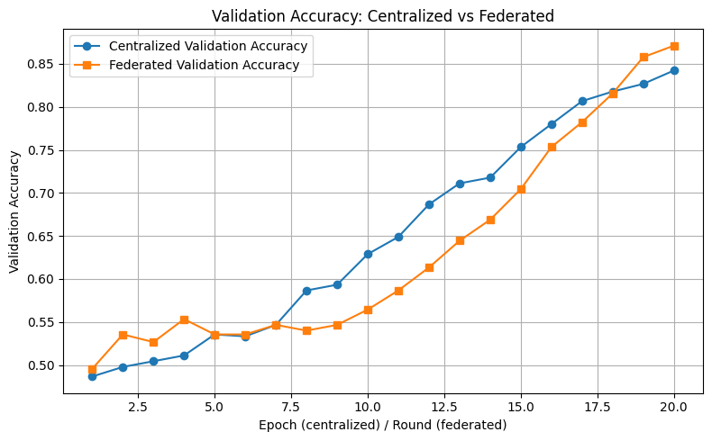

# AI Recruiting System - Membership Inference Attack Analysis

Implemented federated learning for an AI-powered resume screening system, comparing it with a centralized baseline model.

## Overview

This project demonstrates the importance of federated learning. Instead of training a centralized model, server and client communication is simulated to train a FedAvg algorithm with decentralized data.

## Steps to Run
Run each cell sequentially

## Dataset

### Use Case
The system evaluates resume suitability for different job categories in an AI recruiting pipeline, classifying resumes as "suitable" (1) or "not suitable" (0) for specific positions.

### Sample Size & Label Distribution
- **Total Samples**: 3000
- **Job Categories**: 3 categories with 1000 resumes each
  - Software Engineer: 1000 samples (500 suitable, 500 unsuitable)
  - Product Manager: 1000 samples (500 suitable, 500 unsuitable)
  - Designer: 1000 samples (500 suitable, 500 unsuitable)

### Generation Method
Resumes were synthetically generated using category-specific templates, keyword library and randomly picked names and emails:

**Software Engineer Templates**:
- Suitable: "Java", "C++", "Python", "Go", "Rust", "Git", "System Design", "Algorithms"...
- Unsuitable: Product Manager or Designer

**Product Designer Templates**:
- Suitable: "Roadmap", "Stakeholder Management", "Analytics", "Agile", "Scrum", "A/B Testing"...
- Unsuitable: Software Engineer or Designer

**Designer Templates**:
- Suitable: "Figma", "Sketch", "Adobe XD", "Photoshop", "Illustrator", "InDesign", "Prototyping"
- Unsuitable: Software Engineer or Product Manager

### Example Resume Entries

**Software Engineer (Suitable)**:
```
Allison Smith - allison.smith.1995@example.com
Practical Software Engineer skilled in Concurrency and PyTorch. Implemented C++ following cross-functional teams best practices. Built production-ready Design Patterns and integrated with web platforms. Developed Concurrency to improve CI pipelines. Led a team that implemented Concurrency using large datasets.
```

**Product Designer (Suitable)**:
```
Anna Davis - anna.davis@icloud.com  
Practical Designer skilled in Illustrator and Adobe XD. Automated Illustrator in the data pipelines pipeline. Conducted Illustrator and reported findings in cross-functional teams. Designed experiments on Illustrator and analyzed stakeholder feedback. Reduced user conversions by 30% using cloud infrastructure.
```

## Code Explaination

### 1. Environment Setup

Libraries like trasnformer, Pytorch, pandas, faker and numpy are installed and seed value is set to make sure the random generation is controlled and reproducable

### 2. Categories and random PII Generation for Synthetic data structure

3 main Job categories are chosen for data generation where some expected keywords and sentence templates are predefined along with random name and email address generation using faker

```python
def generate_resume_test(target_category: str, positive: bool, max_words: int = 80, min_sentences: int = 2, max_sentences: int = 5):
```
Generates a single synthetic resume text for a given job category. The resume can be either positive/suitable or negative/unsuitable depending on the positive flag. The first sentence is always a summary sentence followed by a variable number of experience points.

```python
def generate_balanced_dataset(per_class: int = 100, enforce_unique_texts: bool = True, max_attempts_per_item: int = 50):
  ```
Generates a full synthetic dataset of resumes for all job categories, balancing positive and negative samples. In the code I run, there's 500 resumes per class (suitable/non-suitable) for each of the 3 categories. Calls the function above for generating individual resumes. Also assigns the labels 1/0 depending on usage of the keywords for the job category. Convert to a pandas dataframe at the end and shuffle it to simulate federated learning with iid data.

# 3. Resume Classification with Centralized and Federated Learning

---

## 1. Dataset

- **Synthetic Resumes**:  
  - Generated with a mixture of positive and negative samples for each job category.  
  - Each category: **500 positive** + **500 negative** examples → **balanced dataset**.  

- **Categories**: 3 (e.g., Data Scientist, Software Engineer, Marketing).  

- **Partitioning Strategy**:  
  - **Clients**: 5 simulated organizations.  
  - **Split**: Shuffled dataset before dividing into clients, with each client getting roughly 600 samples. The initial dataset is balanced with suitable/unsuitable resumes, so iid data.
  - **Motivation**: Since there are few big organizations with many resumes, used a small number of clients. Each client company would have many more resumes since the data would be concentrated.

- **Why IID?**  
  - For a simple architecture, using IID is better as performance is better even it is not representative of real life scenarios. One of the primary reasons for implementing FL is to make a privacy aware system which is still achieved with IID data.  

---

## 2. Model Architecture – ResumeLSTM

- **Text Embedding Layer**  
  - Input: token IDs from resumes text, which allows the model to understand keywords 
  - Output: 128-dim dense embeddings per token.  

- **Category Embedding Layer**  
  - Input: discrete job category ID
  - Output: 32-dim dense embedding vector. Both text embedding and category are used together because classification should be with respect to the job category. 

- **Bidirectional LSTM**  
  - Hidden size: 256 per direction.  
  - Processes resumes left-to-right and right-to-left. Need bidirectional because resumes don't always follow the same order for information. For example some candidates might have experience first, while others would have education.
  - Captures both **local syntax** (a phrase) and **global semantics** (a sentence). Kept it medium sized since synthetic data has a trivial pattern and training is easier with this architecture. 

- **Pooling & Concatenation**  
  - Apply **mean pooling** over all hidden states.  
  - Concatenate with category embedding → combined representation. Combines category and text embedding 

- **Dropout (p=0.3)**  
  - Regularization to reduce overfitting.  

- **Fully Connected Layer**  
  - Linear projection to scalar logit.  
  - Suitable for binary classification with `BCEWithLogitsLoss`.  

**Design Justification**:  
- LSTM strikes balance between **expressiveness** and **efficiency**.  
- Transformer models could improve F1 but would dramatically increase communication in FL due to size of the model 
- Explicit category embeddings allow the model to incorporate prior knowledge (job domain). Explicit embeddings inject prior knowledge: The same resume should be scored differently depending on whether the target is Software Engineer vs. Product Manager.

---

## 3. Training Setup

### Centralized Baseline
- **Optimizer**: AdamW  
- **Learning Rate**: `5e-3` (with scheduler): experimented with a smaller learning rate, but it got stuck in local minimas with little fluctuation in performance
- **Batch Size**: 32  
- **Epochs**: 20  
- **Evaluation**: Accuracy, F1 Score, Loss  

### Federated Training (FedAvg)
- **Rounds**: 20  
- **Clients**: 5 (all participate each round, no client sampling).  
- **Local Training per Round**: 3 epochs per client.  
- **Learning Rate**: `5e-3`  
- **Batch Size**: 32  

**Rationale for Local Epochs = 3**:  
- <3 → convergence is too slow.  
- >5 → overfitting on local client distributions.  
- 3 provides a **trade-off between generalization and efficiency**.  

---

## 4. Aggregation Method – FedAvg

**Algorithm Flow**:  
1. Server initializes and distributes the global model to all clients.  
2. Each client performs local training (3 epochs).  
3. Clients upload updated weights to server.  
4. Server computes **weighted average** of client updates, weighted by dataset size.  
5. New global model redistributed to all clients.  

**Why FedAvg?**  
- Simple and computationally cheap.  
- Strong baseline in heterogeneous settings.  
- Alternatives (FedProx, Scaffold) may improve performance in extreme non-IID, but not required here.  

---

## 5. Communication Cost Analysis

Formula:  
\[
\text{Cost} = 2 \times (\#\text{params} \times 4 \text{ bytes}) \times \#\text{clients} \times \#\text{rounds}
\]

- **Model Parameters**: ~821,729  
- **Parameter Size**: ~3.3 MB (float32)  
- **FL (20 rounds, 5 clients)**:  
  \[
  2 \times 821,729 \times 4 \times 5 \times 20 \approx 656 \text{ MB}
  \]  
- **Centralized Baseline**: Uploading resumes (~1500 samples × 400 bytes each = 600 KB) is **orders of magnitude smaller**.  

**Observation**:  
- Centralized → communication cost is negligible.  
- Federated → major overhead is model weight transfer, not raw data.  

---

## 6. Performance Comparison

.png)
.png)


| Training Setup | Accuracy | F1 Score | Convergence | Communication Overhead |
|----------------|----------|----------|-------------|-------------------------|
| Centralized    | 0.84    | 85.0%    | Faster      | Minimal (single upload of dataset) |
| FedAvg (5 clients, 20 rounds, 3 local epochs) | 0.87 | 87% | Slower | High (≈600 MB model transfer) |

**Key Insights**:  
- Centralized achieves faster convergence though the ending performance for federated learning is better  
- FedAvg and Centralized model perform similarly for F1. The gap between the two is greater for loss, with FedAvg ending at a lower loss  
- Communication overhead in FL is the **biggest bottleneck**.  

---

## 7. Privacy Risk Assessment

- **Risk Level**: MEDIUM  
- **Vulnerability**: Still vulnerable to Membership Inference Attacks and malicious clients in the real world. Also gradient inversion can be used to recreate raw data is transmission is intercepted  

**Takeaway**: While FL reduces direct data sharing, models are still vulnerable to inference attacks — requiring **defense techniques** (e.g., DP-FedAvg, secure aggregation).  

---

## 8. Trade-Offs

### Strengths
- **LSTM** is efficient and expressive enough for sequence data. We want to take advantage of the sequence of the words, not only keywords themselves because the same word can be relevant/non-relevant for a job category depending on context 
- Federated setup keeps raw resumes local, so email and names are not shared
- Balanced dataset allows clean comparison of architectures

### Weaknesses
- FL incurs large **communication overhead** in this case especially beacuse the model size is much bigger than the number of clients participating. This makes it impractical for this synthetic data setup specifically 
- LSTM may underperform compared to transformer baselines.  

---

## 9. Summary

This project demonstrates:  
- **Centralized training** → performance upper bound with low communication cost in the scenario where number of clients and data outweight the model size 
- **Federated training (FedAvg)** → enables decentralized training with competitive performance but significantly higher communication for this specific setup
- **LSTM** → balances sequence modeling and efficiency, making it a practical choice for federated scenarios.  


## AI Disclosure

* Generating templates and keywords and setting up the synthetic dataset with variable number of sentences and keywords in each entry was done with AI
* A boilerplate bi-directional LSTM implementation was generated with AI and then hyperparameters were tuned
* Averaging weights logic after each round for federated learning was generated with AI
* Plotting the 3 separate graphs was done using AI
* Formatting this README