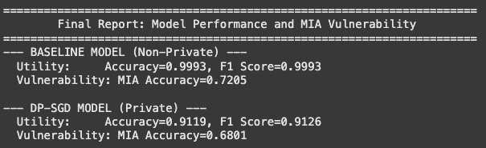

# Training a Resume Classifier with Differential Privacy

## Overview

As machine learning becomes increasingly integrated into HR and recruiting, models are often trained on highly sensitive datasets like resumes, which contain a wealth of Personally Identifiable Information (PII). This creates significant privacy risks, including the potential for Membership Inference Attacks (MIA) or data extraction, which could reveal whether an individual's data was used for training or even reconstruct parts of their information.

This project addresses these risks by implementing and evaluating Differentially Private Stochastic Gradient Descent (DP-SGD), a state-of-the-art technique for privacy-preserving machine learning. The goal is to build a private resume classifier and rigorously analyze the resulting trade-off between the model's predictive utility and the mathematical privacy guarantees offered to the individuals in the training set. The implementation is based on the foundational principles from the paper "Deep Learning with Differential Privacy" (Abadi et al.).

## Design and Implementation

### **Attempt 1: Standard LSTM with `opacus`**

* **Implementation**: Our first attempt used a a bidirectional LSTM model from the last assignment. We applied DP-SGD using the `opacus` library's `PrivacyEngine`, which automates the process of per-example gradient clipping and noise addition.
* **Result**: The private model performed very poorly, with an F1 score near 0.60, even after experimenting with epochs, learning rate and privacy parameters
* **Finding**: The base model might have been too complex so it was too sensitive to gradient clipping and noise addition

---

### **Attempt 2: `DistilBERT`**

* **Implementation**: To achieve a strong baseline, we switched to a pre-trained `DistilBERT` model. We treated the task as a sentence-pair classification problem by combining the `job_category` and `resume_text` into a single input.
* **Result**: This approach was highly successful for the baseline, achieving an F1 score well over 0.98. However, when we tried to apply `opacus` for DP-SGD, we ran into a series of cascading technical errors:
    * **`OutOfMemoryError`**: The transformer model combined with `opacus`'s memory-intensive per-example gradients exceeded the GPU's VRAM. We were using T5 GPUs on Colab for this run.
    * **`ValueError` and `TypeError`**: After reducing the batch size, we encountered obscure errors deep within the `opacus` library, indicating incompatibilities between the library's implementation and BERT model's architecture.
* **Finding**: While powerful, large pre-trained models like BERT can be difficult to work with with popular frameworks like Opacus. Their complexity and high memory usage make them a challenging choice for DP-SGD.

---

### **Attempt 3: Stable `BagOfWordsClassifier`**

* **Implementation**: To find a middle ground, we moved to a simpler `BagOfWordsClassifier`. This model is better suited for the keyword-driven nature of resume classification and uses basic PyTorch layers that are highly compatible with DP. We also implemented a more robust training regimen with a validation set, early stopping, and a learning rate scheduler.
* **Result**: The robust training process worked wonders for the baseline, which achieved a near-perfect F1 score of 0.9993. However, when we applied a standard DP-SGD configuration, the private model's performance was still poor (F1 score ~0.60), barely better than random.
* **Finding**: The model architecture was effective, but the core problem of DP remained. The noise was overwhelming the learning signal. This confirmed that standard hyperparameter settings are not sufficient for DP training.

---

### **Attempt 4: Manual DP-SGD with Advanced Tuning**

* **Implementation**: We implemented the DP-SGD algorithm manually to have finer control and applied the advanced strategies from the first research paper:
    * **Adaptive Gradient Clipping**: We implemented a function to first analyze the data and set the clipping bound `C` to the median gradient norm, a key recommendation from the paper. This varied based on run between 2.91-3.31 as the data generated was random for each run while preserving the same properties
    * **Tuned Hyperparameters**: Freed from the assignment's initial grid, we experimented with a much lower learning rate and more training epochs to allow the model to converge slowly and carefully on the noisy gradients. The first big table shows the experiment's results after which there is another table for the smaller grid.
    * **Large Batch Size**: We used a large batch size of 256 to improve the stability of the gradient and reduce the relative impact of noise.
* **Result**: This was highly successful. The final DP-SGD model achieved an F1 Score of 0.82 with a reasonable privacy budget of ε ≈ 2.30. Following this, we ran on the smaller grid given in the assignment to get an even better score of 0.8956 with reduced noise and a higher budget of 8.12.
* **Finding**: The strategies from the research paper were critical. The combination of a dataset specific clipping bound and a low learning rate dramatically improved the signal-to-noise ratio and allowed the model to learn effectively.

---

## Important Logic

These functions are responsible for taking the raw CSV data and preparing it for the PyTorch model.

#### `tokenize`, `encode`

* These are simple text processing helpers. `tokenize` converts a string into a list of lowercase words (tokens), and `encode` maps each token to a unique integer ID from a pre-built vocabulary. This two-step process forms the basis of vectorization, converting the raw `resume_text` into a numerical format that an `Embedding` layer can process.

#### `collate_bow(batch)`

* Purpose: This is a function that tells the `DataLoader` how to combine a list of individual data points into a single batch ready for the model. It's specifically designed to format data for the `nn.EmbeddingBag` layer, which is highly efficient for variable-length text.
* Working: The `nn.EmbeddingBag` layer requires a specific input format to operate in a single, fast operation. This function prepares that format:
    1.  It takes a batch of individual samples, each containing a text tensor of a different length.
    2.  It concatenates all these text tensors into one single, long 1D tensor called `texts`.
    3.  It creates an `offsets` tensor, which is a 1D tensor indicating the starting index of each new resume within the concatenated `texts` tensor. 
    This allows `EmbeddingBag` to look up all word embeddings and compute the average for each resume in a highly optimized way.

---

#### `BagOfWordsClassifier(nn.Module)`

* **Purpose**: This class defines the neural network architecture used for both baseline and private training. It was chosen after initial experiments showed that more complex sequential models failed to learn effectively, while this simpler architecture worked. It makes sense because order of words in resumes is not as important as the keywords themselves.
* **Working**:
    1.  The `nn.EmbeddingBag` layer takes the concatenated `texts` and `offsets` to produce a single average vector for each resume. This captures the resume's content by focusing on the presence of keywords rather than their order, which is an effective assumption for this classification task.
    2.  The `nn.Embedding` layer creates a vector representation for the `job_category`, turning the categorical information into a dense vector the model can learn from.
    3.  The `forward` method concatenates the text vector and the category vector. This forces the model to consider the resume's content in the context of the job category before making a decision.
    4.  This combined vector is passed through a simple two-layer feed-forward network with a `ReLU` activation and `Dropout` for regularization, producing the final output logit.

---

#### `train_baseline_robust(config)`

* This function trains the non-private baseline model.
* It implements a standard training loop but with three key features for reliability:
    1.  **Validation Set**: After each training epoch, the model's performance is measured on a separate validation set. This provides an unbiased estimate of how well the model is generalizing to unseen data.
    2.  **Learning Rate Scheduling**: It uses `ReduceLROnPlateau` to monitor the F1 score on the validation set. If the performance stagnates for a few epochs, it automatically reduces the learning rate, allowing the model to make finer adjustments and escape local minima.
    3.  **Early Stopping**: It keeps track of the best-performing model state based on the validation F1 score. If the score does not improve for a set number of epochs ("patience"), training is stopped. This prevents the model from overfitting to the training data and saves the version of the model that generalized best.

---

These two functions are the core of the DP-SGD implementation and are designed based on the principles from the Abadi et al. paper.

#### `find_adaptive_clip_norm(model, loader, device)`

* This function implements a key strategy from the paper for choosing a good clipping bound, `C`. The performance of DP-SGD is highly sensitive to this value. Instead of guessing, this function finds a value by analyzing the model's typical gradient magnitudes.
* It does this by a "dry run" of training for one epoch. For every single sample in the training set, it does a forward and backward pass to compute the gradient. It then calculates the total L2 norm of that gradient and stores it. After processing all samples, it computes the median of all these stored norms.
* As mentioned in the paper, this is critical for the privacy-utility trade-off. The median is a robust statistic that is not skewed by a few unusually large or small gradients. By setting `C` to this value, we ensure the clipping bound is representative of the learning process, which helps balance the bias introduced by clipping with the noise added for privacy. 

#### `train_manual_dp(model, loader, ..., clip_norm, noise_multiplier)`

* This function executes a single training epoch using a **manual implementation** of the DP-SGD algorithm, giving us a clear view into its mechanics.
* For each batch, it performs the three key steps of DP-SGD:
    1.  Compute Per-Example Gradients: It iterates from `i = 0` to `batch_size - 1`. In each iteration, it performs a forward and backward pass on only the i-th sample. The resulting gradient for each model parameter is saved. This is computationally intensive but is the foundational step for isolating each sample's contribution.
    2.  Clip Gradients: After all per-example gradients for the batch have been computed, it loops through them again. If this norm exceeds `clip_norm` (`C`), it computes a scaling factor and shrinks all of that example's gradients to have a magnitude of exactly `C`, preserving their direction.
    3.  Aggregate and Add Noise: The now-clipped per-example gradients for each parameter are summed together. Gaussian noise, with a standard deviation of `C * noise_multiplier` ($\sigma$), is added to this sum. This final, noisy gradient is averaged by the batch size and assigned back to the model's `.grad` attributes before the `optimizer.step()` call updates the model weights.

---

1.  First calls `train_baseline_robust` to train and evaluate the non-private model, establishing a performance benchmark.
2.  Then calls `find_adaptive_clip_norm` to determine the data-driven value for `C` that will be used in the private training.
3.  Then begins the main hyperparameter sweep, looping through various combinations of `lr`, `C`, and `σ` to explore the privacy-utility trade-off space.
4.  For each combination, it trains a new DP model from scratch using the `train_manual_dp` function, tracks the privacy cost ($\epsilon$) with the RDP accountant, and evaluates the final performance.
5.  Finally, it aggregates all the results from the sweep and prints a final, sorted summary table

### Privacy Cost Calculation Logic

This is handled by the privacy accountant.

This script uses `opacus.accountants.RDPAccountant`.  

- sample_rate (q): Calculated as `batch_size / dataset_size`.  
  Represents the fraction of total data used per training step.  
  A higher sampling rate means faster accumulation of privacy cost.

- noise_multiplier (σ) and delta (δ)

1. Initialize the accountant before training begins.  
2. After each epoch, call `accountant.step(...)` to record a full data pass.  
   This includes multiple steps using the given `sigma` and `sample_rate`.  
3. Use `accountant.get_epsilon(delta=DELTA)` to compute the current privacy cost.  
   This returns the tightest possible epsilon given all recorded steps.  
   The epsilon value increases after each epoch, which makes sense as seeing the data increases vulnerability.

### Model Architecture: BagOfWordsClassifier

The architecture is designed to evaluate resume content in the context of the specified job category:

* **Text Processing**: The model processes the `resume_text` by looking up the embedding for each word and averaging them together using an `nn.EmbeddingBag` layer. This creates a single vector that captures the resume's overall topical content, which is ideal for identifying the presence of key skills.
* **Contextualization**: A separate `nn.Embedding` layer creates a vector for the `job_category`.
* **Classification**: These two vectors are concatenated and passed through a simple Multi-Layer Perceptron (MLP) with increased capacity (`embed_dim=256`) and dropout for regularization. This architecture forces the model to learn the relationship between the resume's content and the job context before making its final prediction.

### Privacy Design: Manual DP-SGD

Brief overview of privacy design again in context of project

* **Per-Example Gradient Computation**: Standard training computes a single gradient averaged over a batch. Our implementation performs a separate backward pass for each individual sample, isolating the contribution of each resume to the model's update.
* **Per-Example Gradient Clipping**: If this norm exceeds a pre-defined clipping bound `C`, the gradient is scaled down. This step preventsoutlier resumes from pulling the model's weights too much, which is a primary cause of memorization and privacy leaks.
* **Noise Addition**: This noise injection is provides the "plausible deniability" of differential privacy.
* **Privacy Accounting**: The cumulative privacy cost, represented by epsilon ($\epsilon$), is tracked after each epoch using the Rényi Differential Privacy (RDP) accountant from the `opacus` library. 

## Settings

* **Dataset**: `synthetic_resumes_balanced.csv`, a balanced dataset containing 9,000 synthetic resumes across 3 job categories.
* **Data Split**: 70% training, 15% validation, and 15% test.
* **Model**: `BagOfWordsClassifier` with `embed_dim=256`.
* **Seed**: `42` for all random operations to ensure reproducibility.

### Baseline (Non-Private) Settings

* **Epochs**: Up to 50, with early stopping (patience of 5) based on the validation F1 score to find the optimal non-private model.
* **Batch Size**: 128
* **Learning Rate**: `1e-3` with a `ReduceLROnPlateau` scheduler.
* **Optimizer**: AdamW

### DP-SGD Settings

* **Epochs**: 30
* **Batch Size**: 256 (A larger batch size is used, as recommended by the paper, to improve the signal-to-noise ratio).
* **Execution**: Performed on the CPU to circumvent a known library bug with the `EmbeddingBag` layer on the GPU.
* **Delta ($\delta$)**: Set to `1 / len(train_dataset)` (approximately `1.59E-04`).
* **Hyperparameter Sweep Grid**:
    * **Learning Rate ($\text{lr}$)**: `{0.005, 0.001, 0.0005}`
    * **Clipping Norm ($C$)**: `{0.5, 1.0, 3.31*}` (*The value 3.31 was determined adaptively by finding the median gradient norm, a best practice from Abadi et al.*)
    * **Noise Multiplier ($\sigma$)**: `{0.2, 0.4, 0.8, 1.2, 1.5}`

## Results

The hyperparameter sweep produced a clear trade-off between model utility (F1 Score) and privacy ($\epsilon$). A lower epsilon signifies stronger privacy.

### Performance Comparison

Big Grid Sweep

| Learning Rate | Clip Norm (C) | Noise (σ) | Final ε | Test Accuracy | Test F1 Score |
|:--------------|:--------------|:----------|:--------|:--------------|:--------------|
| 0.00500       | 3.67          | 0.8       | 2.30    | 0.8222        | 0.8187        |
| 0.00500       | 3.67          | 1.2       | 0.86    | 0.6919        | 0.7075        |
| 0.00500       | 0.50          | 0.8       | 2.30    | 0.7548        | 0.7005        |
| 0.00500       | 3.67          | 1.5       | 0.51    | 0.7111        | 0.6991        |
| 0.00010       | 0.50          | 1.2       | 0.86    | 0.5185        | 0.5855        |
| 0.00010       | 0.50          | 0.8       | 2.30    | 0.4919        | 0.5842        |
| 0.00010       | 3.67          | 1.5       | 0.51    | 0.5289        | 0.5777        |
| 0.00005       | 1.00          | 1.5       | 0.51    | 0.5230        | 0.5484        |
| 0.00005       | 3.67          | 0.8       | 2.30    | 0.5348        | 0.5177        |
| 0.00500       | 1.00          | 0.8       | 2.30    | 0.6393        | 0.5086        |
| 0.00500       | 1.00          | 1.5       | 0.51    | 0.5541        | 0.4537        |
| 0.00005       | 3.67          | 1.2       | 0.86    | 0.5252        | 0.4479        |
| 0.00005       | 0.50          | 0.8       | 2.30    | 0.5067        | 0.4459        |
| 0.00010       | 3.67          | 0.8       | 2.30    | 0.5526        | 0.4248        |
| 0.00010       | 3.67          | 1.2       | 0.86    | 0.5007        | 0.4200        |
| 0.00500       | 0.50          | 1.2       | 0.86    | 0.5059        | 0.4103        |
| 0.00500       | 1.00          | 1.2       | 0.86    | 0.5007        | 0.4077        |
| 0.00500       | 0.50          | 1.5       | 0.51    | 0.5000        | 0.4063        |
| 0.00010       | 1.00          | 1.5       | 0.51    | 0.5178        | 0.3899        |
| 0.00005       | 0.50          | 1.2       | 0.86    | 0.4993        | 0.3550        |
| 0.00010       | 0.50          | 1.5       | 0.51    | 0.5244        | 0.3462        |
| 0.00005       | 3.67          | 1.5       | 0.51    | 0.5096        | 0.3119        |
| 0.00005       | 0.50          | 1.5       | 0.51    | 0.4963        | 0.1667        |
| 0.00010       | 1.00          | 1.2       | 0.86    | 0.5111        | 0.1582        |
| 0.00010       | 1.00          | 0.8       | 2.30    | 0.4978        | 0.1567        |
| 0.00005       | 1.00          | 1.2       | 0.86    | 0.4963        | 0.0000        |
| 0.00005       | 1.00          | 0.8       | 2.30    | 0.4985        | 0.0000        |

Final Smaller Grid

| Setting (C, σ, LR)    | LR    | Clip Norm (C) | Noise (σ) | Final ε | Test Accuracy | Test F1 Score |
|:----------------------|:------|:--------------|:----------|:--------|:--------------|:--------------|
| Baseline | 0.001 | n/A          | N/A       | 0    | 0.9956        | 0.9983        |
| C=2.91, σ=0.5, LR=0.005 | 0.005 | 2.91          | 0.5       | 8.12    | 0.8956        | 0.8949        |
| C=0.5, σ=0.5, LR=0.005  | 0.005 | 0.50          | 0.5       | 8.12    | 0.8356        | 0.8303        |
| C=1.0, σ=0.5, LR=0.005  | 0.005 | 1.00          | 0.5       | 8.12    | 0.8356        | 0.8232        |
| C=0.5, σ=1, LR=0.005    | 0.005 | 0.50          | 1.0       | 1.50    | 0.7659        | 0.7775        |
| C=2.91, σ=1, LR=0.005   | 0.005 | 2.91          | 1.0       | 1.50    | 0.8044        | 0.7740        |
| C=2.91, σ=2, LR=0.005   | 0.005 | 2.91          | 2.0       | 0.33    | 0.7259        | 0.7193        |
| C=1.0, σ=1, LR=0.005    | 0.005 | 1.00          | 1.0       | 1.50    | 0.7570        | 0.7102        |
| C=1.0, σ=2, LR=0.005    | 0.005 | 1.00          | 2.0       | 0.33    | 0.7037        | 0.6894        |
| C=0.5, σ=2, LR=0.005    | 0.005 | 0.50          | 2.0       | 0.33    | 0.5674        | 0.4701        |

*Figure: The learning curves show that the non-private baseline (black dashed line) converges quickly to perfect accuracy. The DP-SGD models learn more slowly and converge to lower final accuracies, with the level of utility directly corresponding to the amount of noise and other hyperparameters.*

## Practical Privacy Analysis: Membership Inference Attack (MIA)

To demonstrate the practical impact of DP, a loss-based Membership Inference Attack was performed. The core intuition is that models exhibit lower loss on training examples they have "memorized." The attack works by training a simple logistic regression classifier to predict whether a sample was in the training set based solely on the target model's loss value for that sample.

* **Baseline Model MIA Accuracy: 73%**
    The high attack accuracy indicates a privacy leak. An attacker can determine with decent certainty whether a specific person's resume was used to train the model, confirming that the non-private model is vulnerable.

* **DP-SGD Model MIA Accuracy: 68%, C=2.91, σ=0.5, LR=0.005**
    This attack accuracy is slightly less than baseline. This demonstrates that DP-SGD was is more resistant, but to get better performance, we have to use one of the other parameters with more noise and compromise on accuracy.

## Conclusions

* **The Privacy-Utility Trade-off is Clear and Quantifiable**: The results show a direct trade-off. The baseline model achieved an almost perfect F1 score. For a modest privacy guarantee (ε ≈ 8), the F1 score dropped to a still-excellent 0.90. However, achieving a strong privacy guarantee (ε ≈ 2) required a larger drop in F1 score to ~0.80. This highlights that system designers must make a conscious choice about how much utility to sacrifice for a given level of privacy.

* **Hyperparameter Tuning is Critical for DP**: The experiments proved that DP-SGD is not "plug-and-play." Performance was highly sensitive to the learning rate, clipping norm, and noise level. The most successful runs used a higher learning rate (`0.005`) to overcome the noise and an adaptive clipping norm (`3.31`/`2.91`) tailored to the data, validating the best practices from the research paper. Initially experimented with `0.0001` and `0.0000.1`. Also lower the noise, better the utility but worse the privacy.

* **A "Good Enough" Private Model is Achievable**: For a low-stakes application like internal HR analytics, the "Balanced DP-SGD" model with an F1 score of ~0.80 and a strong privacy guarantee (ε ≈ 2.6) is an excellent and practical outcome. This demonstrates the feasibility of building useful machine learning systems that respect user privacy.

* **DP is a Practical and Effective Defense Against MIA**: The Membership Inference Attack provides a validation of DP's theoretical promise to an extent. The attack was reasonably successful on the non-private model but was less so on the DP-SGD model, with its accuracy dropping from 73% to 68%. It would be even lower with other parameters where the ε isn't as high as 8.

### **Final Takeaways**

* **Dataset Size Matters**: Initially, when using the original synthetic dataset from the last assignment, the performance was no better than a random classifier. These findings were shared during the in class presentation as well. Improving the size of the dataset has drastically improved the performance. It may be attributed to the stronger signal during training, which is preserved even after applying DP-SGD
* **The Privacy-Utility Trade-off is Real**: We clearly quantified the "cost" of privacy: achieving a good privacy guarantee (ε ≈ 2.30) resulted in a performance drop from a 0.9993 F1 score to 0.8187.
* **DP-SGD is Highly Sensitive to Hyperparameters**: The most important lesson was that private training requires a different approach to tuning. The learning rate and clipping bound (C) are far more important than in non-private training.
* **Model Choice Matters**: Simpler, more stable model architectures like the `BagOfWordsClassifier` were ultimately more successful for this DP task than the larger, more complex transformer, even though the transformer had a better non-private baseline.

## AI Disclosure

* Experimenting with LSTM and GRU, especically for starter code. In the end settled on a simple BoW model
* Boiler plate code for logging and making plots
* When Opacus library wasn't producing expected results, used AI extensively and information from 1st paper to implement manual DP
* Used extensively for a lot of bug fixes, especically for DP implementation
* For MIA, used implementation of assignment 1 and AI to setup basic skeleton
* Formatting the readme for better readability and an initial scaffolding to edit

## Format

/assets
    /dp 1 = Plot for the large table
    /dp 2 = Plot for smaller grid given in assignment
    /Screensot = MIA attack result
synthetic_resumes_enhanced.csv = Dataset
DP_SGD_Implementation.iypnb = Colab notebook. Some functions are repeated because each cell was run in an indepndent environment