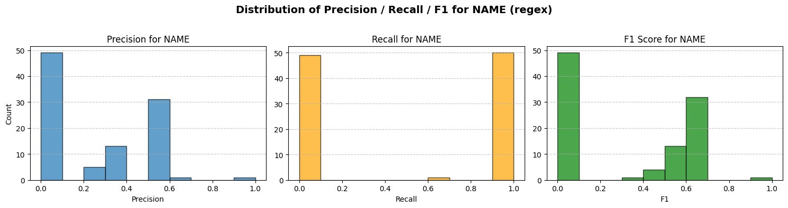
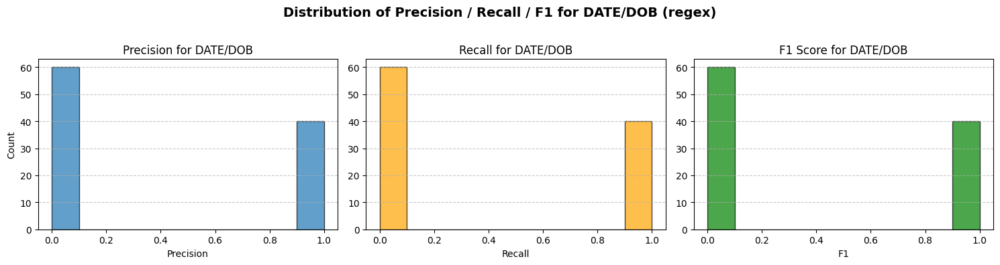
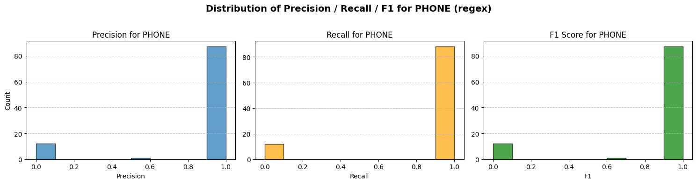
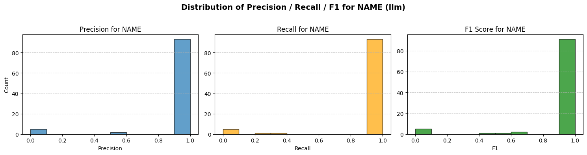
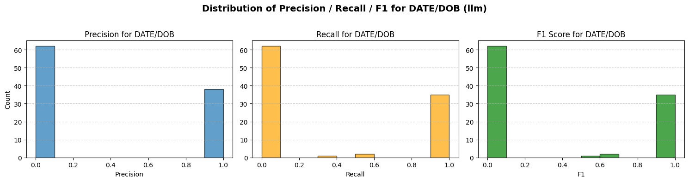
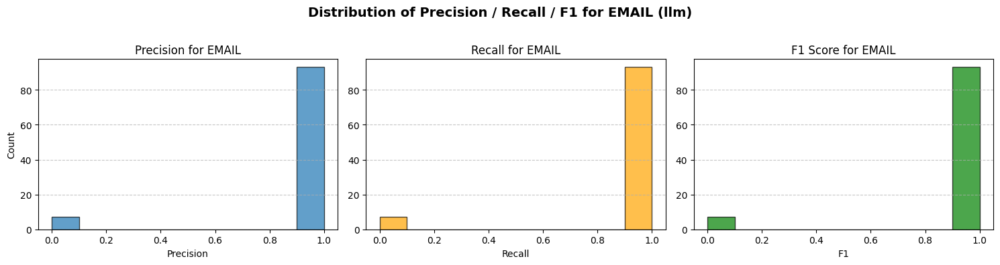
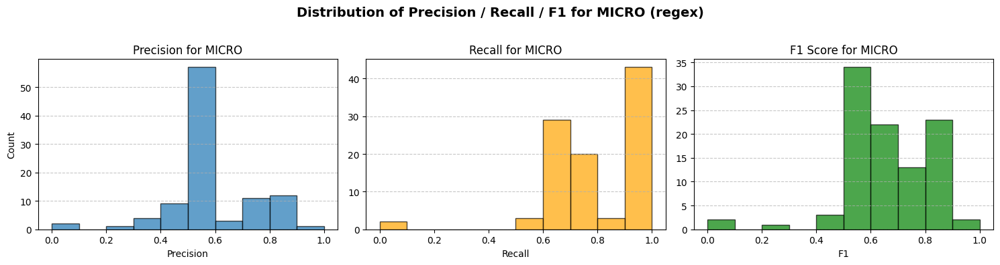
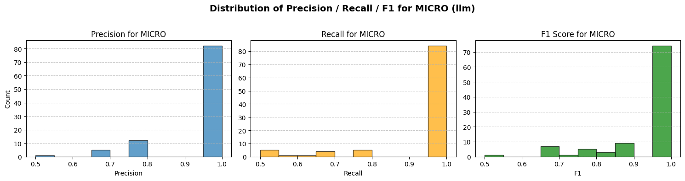

# AI Recruiting Privacy Analysis - PII Detection and Redaction Study

This project explores different methods for detecting and redacting Personally Identifiable Information (PII) in synthetic resume data. The methods include a custom **Regex-based detector** and a **Large Language Model (LLM)**-based detector, evaluated against a small ground truth dataset.

## 1. Dataset

The synthetic resume dataset is designed to contain several categories of PII, explicitly focusing on:

* **EMAIL**: Email addresses.
* **PHONE**: Phone numbers (in various international formats).
* **DATE/DOB**: Dates, including explicit Dates of Birth (DOB).
* **NAME**: Full names.

The notebook mentions the initial dataset was expanded to include `PHONE` and `DATE/DOB` fields, as `EMAIL` and `NAME` were already present.

## 2. Design & Implementation: PII Detection

### Detector Patterns and Validation Checks

The project implements a **Regex-based detector** with the following patterns and helper functions:

| PII Category | Detector Pattern | Validation/Logic |
| :--- | :--- | :--- |
| **EMAIL** | `EMAIL_REGEX` (Standard email format: `[A-Z0-9._%+-]+@(?:[A-Z0-9-]+.)+[A-Z]{2,63}`) | Simple regex matching. |
| **PHONE** | `PHONE_REGEX` (Accounts for optional country code, area code, and various separators like `.`, `-`, `()`) | Normalizes the matched string to digits (`_normalize_phone`). Filters out results that don't have between **7 and 15 digits** (E.164-friendly, excluding single country codes). |
| **DATE/DOB** | `DATE_REGEX` (Matches various date formats: `YYYY-MM-DD`, `DD/MM/YYYY`, `Month DD, YYYY`, bare years `19XX/20XX`) | Attempts to parse the date using multiple common formats (`_try_parse_date`). Prioritizes dates following "DOB" or "Date of Birth" labels. |
| **NAME** | `NAME_LABEL_REGEX` (Matches names following labels like `Name:`, `Full Name:`, `Candidate:`) and `NAME_CAPSEQ_REGEX` (Matches sequences of 2-4 capitalized tokens) | Uses `_likely_human_name` check: must be 2-4 parts, avoids stop words (e.g., "and," "for"), and requires initial/name format for each part. |

The **LLM-based detector** is set up with a `SYSTEM_PROMPT` instructing it to act as a data redaction assistant to:
1.  **MASK** all PII (NAME, PHONE, DATE/DOB, EMAIL, CREDIT\_CARD).
2.  Preserve the rest of the content and layout.
3.  Return a JSON object with the `text` and a list of `entities` (category/value of masked items).

## 3. Redaction Modes

The project demonstrates two primary redaction modes:

### Redaction Method 1: STRICT (Full Masking)

This method, though incomplete in the provided code snippet (`strict_mask` only handles EMAIL, PHONE, and DOB), is intended to **replace the full value of the detected PII** with a generic mask (e.g., `[EMAIL]`, `[PHONE]`, `[DOB]`).

### Redaction Method 2: PARTIAL (Partial Masking)

This method aims to mask most of the PII while revealing a small, less sensitive portion for verification or non-PII utility.

| PII Category | Partial Masking Logic | Example |
| :--- | :--- | :--- |
| **EMAIL** | Keep **first character** of the local-part, mask the rest with `*`, and keep the full domain. | `k***********@gmail.com` |
| **PHONE** | Replace all digits except the **last 4** witfh `*`, while preserving non-digit characters (e.g., `.`, `-`, `()`). | `+*-***-***-****x1039` |
| **DATE/DOB** | Aims to mask the day part, keeping **month and year** (if present in common formats). Uses `**` to mask the day. | `** January 1990` |
| **NAME** | *Not implemented for partial masking in the notebook.* | |

## 4. Results: P/R/F1

The notebook calculates Precision (P), Recall (R), and F1-Score (F1) per category and for a micro-average across the entire dataset.

### Per-Category Performance (Based on Visualized Histograms)

The distributions suggest:

| PII Category | Observation (Regex vs. LLM) |
| :--- | :--- |
| **NAME** | **LLM performs better** at identifying human names and achieves higher average F1/Recall. The Regex method is noted as "very coarse" and generates high False Positives (FP) by picking up non-PII nouns, severely reducing **Precision**. |
| **DATE/DOB** | **Low performance in both methods**. The Regex method is "aggressive" in capturing all date-like strings, leading to FP (e.g., matching job start/end dates). The LLM also struggles, as evidenced by low overall scores in the output histograms. |
| **EMAIL** | Both methods show **high performance** (mostly concentrated at 1.0) due to the rigid, predictable structure of emails, though the LLM's distribution appears slightly more concentrated. |
| **PHONE** | Both methods show **high performance** (mostly concentrated at 1.0) due to the strong structural patterns, though different formats introduce some variance. |

#### Distribution Plots for Regex Method per Category

#### Distribution Plots for LLM Method per Category

### Micro-Average Performance

The micro-average results aggregate True Positives (TP), False Positives (FP), and False Negatives (FN) across all categories for each sample.

| Method | Mean Micro-Average Precision | Mean Micro-Average Recall | Mean Micro-Average F1 Score |
| :--- | :--- | :--- | :--- |
| **Regex** | ~0.70 - 0.90 (Variable distribution) | ~0.80 - 1.0 (Concentrated at higher values) | ~0.80 - 1.0 (Concentrated at higher values) |
| **LLM** | ~0.80 - 1.0 (Highly concentrated at higher values) | ~0.80 - 1.0 (Highly concentrated at higher values) | ~0.80 - 1.0 (Highly concentrated at higher values) |

#### Distribution plots - Micro

The histograms suggest that the **LLM-based detection achieves a tighter distribution of high scores** compared to the Regex method, indicating **higher overall PII detection accuracy and lower false positives/residual leakage** in general across the dataset, particularly for the challenging NAME field.

### Residual Leakage

Residual leakage, indicated by **lower Recall**, primarily occurs when a PII item in the ground truth is missed by the detector. The most notable issue here is the **variability and low average performance in DATE/DOB detection** for both methods, which suggests a significant risk of dates (especially less common formats) remaining in the redacted text.

## 5. Adversarial Tests

The adversarial tests demonstrate the robustness of the LLM vs. the custom Regex detector against intentional obfuscation.

| Example Text | Regex Detector Result | LLM Detector Result | Caught vs. Missed | Known Failure Mode |
| :--- | :--- | :--- | :--- | :--- |
| **1: Email:** `j0hn.d03@ema1l.c0m` | **Missed** (`[]`) | **Caught** (`j0hn.d03@ema1l.c0m`) | **LLM Caught**; Regex missed due to use of digits/special characters in place of letters, breaking the standard pattern. | Regex rigidity. |
| **2: Name:** `K@r3n Sm1th` | **Missed** (`[]`) | **Caught** (`K@r3n Sm1th`) | **LLM Caught**; Regex missed due to non-standard characters (`@`, `3`, `1`) breaking the capitalized sequence logic. | Regex rigidity. |
| **3: Phone:** `+1 234 567 890 1` | **Caught** (`+1 234 567 890 1`) | **Caught** (`+1 234 567 890 1`) | **Both Caught**; Standard numeric format recognized. | None |
| **4: Phone:** `1-800-APPLE` | **Missed** (`[]`) | **Missed** (`[]`) | **Both Missed**; The use of letters in place of digits (`APPLE`) causes both the Regex pattern (designed for digit sequences) and the LLM (which may classify it as a toll-free number or company name) to fail. | Both: Non-standard character set. |
| **5: Email:** `n.i.c.h.o.l.a.s.bowers@gmail.com` | **Caught** (`n.i.c.h.o.l.a.s.bowers@gmail.com`) | **Caught** (`n.i.c.h.o.l.a.s.bowers@gmail.com`) | **Both Caught**; Email regex handles dots well. | None |
| **6: DOB:** `20-OCT-'9O` | **Missed** (`[]`) | **Caught** (`20-OCT-'9O`) | **LLM Caught**; Regex missed due to non-standard short year format (`'9O` instead of `'90`), showing a slight edge for LLM's flexibility. | Regex date format rigidity. |

**Adversarial Failure Modes (Observed):**
* **Regex:** **Rigidity** in pattern definitions, failing on common obfuscation techniques for EMAIL and NAME (using numbers/symbols for letters) and non-standard DATE/DOB formats.
* **LLM:** **Specific knowledge gaps**, such as the non-standard phone number `1-800-APPLE`, which it likely classifies as company/product name text rather than a PII phone number due to the presence of letters.

## 6. Implications

### Sufficiency vs. Risky for Project

| Scenario | Regex Detector | LLM Detector |
| :--- | :--- | :--- |
| **High-Volume/Low-Latency** | **Sufficient.** Extremely fast, suitable for initial, high-throughput filtering. | **Risky.** Runtime is excessively slow (minutes per sample), making it completely impractical for real-time or batch processing of large datasets. |
| **PII Variety/Obfuscation** | **Risky.** Susceptible to simple adversarial examples (obfuscated NAME/EMAIL) and rigid with DATE formats, leading to unacceptable leakage/FP rates for full PII coverage. | **Sufficient.** Shows better generalization and robustness against obfuscation for NAME and EMAIL, offering better residual leakage control in unstructured text. |
| **General Recommendation** | A **hybrid approach** is necessary: Use the **Regex detector for known, common patterns** (standard EMAIL/PHONE) due to its speed, and then use a **fine-tuned, faster LLM/Transformer model** (not `gpt-5`) for the more complex PII categories like NAME and DATE/DOB, or for cleaning the residual text, to balance speed and accuracy. | |
